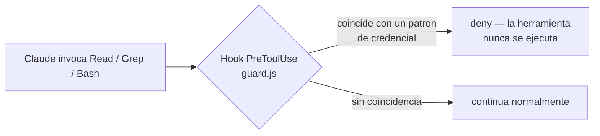

# credential-read-guard

Plugin de Claude Code que bloquea de forma determinista la lectura o
búsqueda de material de credenciales — connection strings, archivos
`.env`, `appsettings*.json`, llaves privadas, `kubeconfig`, `.tfvars`,
entre otros — independientemente del stack del proyecto (.NET, Node,
mobile, infraestructura). El control se aplica a nivel de invocación de
herramienta mediante un hook `PreToolUse`: la llamada se intercepta y se
rechaza antes de ejecutarse, sin depender del comportamiento del modelo.

## Relación con postgres-readonly-mcp

Este plugin es intencionalmente independiente de
[`postgres-readonly-mcp`](https://github.com/DanielWueno/postgres-readonly-mcp-plugin).
Ese plugin garantiza que una conexión a base de datos no pueda usarse para
escribir. Este garantiza que Claude no pueda leer el archivo o variable
donde vive la credencial usada para establecer cualquier conexión, sea a
una base de datos o a otro sistema. Son controles independientes; instalar
uno no otorga las garantías del otro.

## Arquitectura



El hook se ejecuta antes de que la herramienta corra, y evalúa lo
siguiente:

| Herramienta | Evaluación |
|---|---|
| `Read` | `file_path` contra una lista de patrones de archivos de credenciales |
| `Grep` | `path`/`glob` contra los mismos patrones, y `pattern` contra palabras clave asociadas a extracción de secretos (`password=`, `connectionstring`, `api_key`, etc.), independientemente del archivo objetivo |
| `Bash` | el texto completo del comando, buscando combinaciones de comandos de lectura de contenido (`cat`, `type`, `Get-Content`, `head`, `tail`, `strings`, `base64`, etc.) contra un archivo de credenciales, o `grep`/`findstr`/`Select-String` junto con palabras clave de extracción de secretos |

## Patrones cubiertos

`.env*`, `appsettings*.json`, `web.config`/`app.config`, `*.pfx`, `*.p12`,
`*.pem`, `*.key`, `*.jks`, `*.keystore` (firma de aplicaciones
MAUI/Android), `credentials.json`, `id_rsa`/`id_ed25519` (y variantes
`.pub`), `*.ppk`, `.npmrc`, `.netrc`, `secrets.json`/`secrets.yaml`,
`*.kdbx`, `kubeconfig`, `.aws/credentials`, `*.tfvars`, `*.tfstate`.

## Alcance y limitaciones

Este es un filtro basado en patrones, no un sistema de prevención de fuga
de datos (DLP). Limitaciones conocidas:

- **No inspecciona el contenido de scripts que Claude genere.** Si Claude
  escribe un script en Python o Node que abre un archivo de credenciales y
  lo imprime, y luego lo ejecuta con `Bash`, el hook solo evalúa el
  comando que lo invoca (por ejemplo, `python script.py`), no el
  comportamiento interno del script.
- **Ofuscación deliberada no queda cubierta** — nombres de archivo
  construidos a partir de variables de shell, variaciones de mayúsculas/
  minúsculas fuera del alcance de la expresión regular, o comandos de
  lectura no incluidos en la lista (`sed`, `awk`, `perl -pe`, editores de
  texto invocados vía `Bash`).
- **Los servidores MCP de terceros quedan fuera de alcance.** El hook
  únicamente intercepta las herramientas nativas de Claude Code
  (`Read`/`Grep`/`Bash`).
- **La lista de patrones es representativa, no exhaustiva.** Proyectos que
  almacenan secretos bajo nombres de archivo no convencionales no quedan
  cubiertos sin modificar `hooks/guard.js`.

Este plugin constituye un control adicional contra el caso común — Claude
leyendo `appsettings.Development.json` porque lo consideró relevante, o
ejecutando `cat .env` durante una depuración — y no un sustituto de evitar
colocar secretos donde no corresponde, ni del uso de
[roles de base de datos de mínimo privilegio](https://github.com/DanielWueno/postgres-readonly-mcp-plugin)
para cualquier acceso real a datos.

## Requisitos

- Claude Code con soporte de plugins y hooks.
- Node.js disponible en `PATH` (usado para ejecutar `hooks/guard.js`).

## Instalación

**Opción A — uso personal, en todos los proyectos:**

```bash
git clone https://github.com/DanielWueno/credential-read-guard "%USERPROFILE%\.claude\skills\credential-read-guard"
```

Clonar directamente dentro de `~/.claude/skills/<nombre>/` hace que el
plugin cargue automáticamente en cualquier proyecto desde la siguiente
sesión de Claude Code (`credential-read-guard@skills-dir`), sin
configuración por proyecto.

**Opción B — distribución de equipo vía marketplace:**

```bash
git clone https://github.com/DanielWueno/credential-read-guard
claude plugin install credential-read-guard@<marketplace-interno>
```

| Nota de compatibilidad | Detalle |
|---|---|
| `claude plugin install --plugin-dir <ruta>` | No disponible en todas las versiones de Claude Code — en algunas versiones, `claude plugin install` solo resuelve plugins contra marketplaces configurados. Verificar las opciones disponibles con `claude plugin install --help` en la versión instalada. |

Después de instalar, reiniciar la sesión de Claude Code (o abrir `/hooks`
una vez) — los hooks se cargan al inicio, no se aplican a una sesión ya en
curso.

## Verificación

Tras reiniciar, solicitar a Claude que lea un archivo
`appsettings.Development.json`, o que ejecute `cat .env`, en un proyecto
donde el plugin esté activo. La llamada debe ser rechazada con un mensaje
con el prefijo `credential-read-guard: ...`, en vez de devolver el
contenido del archivo.

Para probar el script del hook de forma directa, sin una sesión de Claude
Code:

```bash
echo '{"tool_name":"Read","tool_input":{"file_path":"appsettings.Development.json"}}' | node hooks/guard.js
```

Un objeto JSON con `"permissionDecision":"deny"` indica que la llamada
sería bloqueada. Sin salida (exit 0) indica que sería permitida.

## Licencia

MIT
