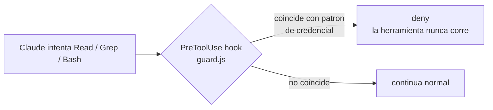

# credential-read-guard

Plugin de Claude Code que bloquea, de forma **determinista**, que Claude lea
o busque credenciales — connection strings, `.env`, `appsettings*.json`,
llaves privadas, `kubeconfig`, `.tfvars`, etc. — sin importar el stack del
proyecto (.NET, Node, mobile, infra). No depende de que el modelo "elija"
no leer un archivo: la llamada a la herramienta se intercepta y se rechaza
antes de ejecutarse.

Es un proyecto separado de [`postgres-readonly-mcp`](https://github.com/DanielWueno/postgres-readonly-mcp-plugin)
a propósito: ese resuelve que la base de datos no pueda ser modificada; este
resuelve que Claude no pueda leer el archivo/variable donde vive la
credencial para conectarse a ella (o a cualquier otro sistema). Son capas
independientes — no instales uno asumiendo que cubre al otro.

## Como funciona



El hook corre **antes** de que la herramienta se ejecute, revisando:

- `Read` — el `file_path` contra una lista de patrones de archivos de
  credenciales.
- `Grep` — el `path`/`glob` contra los mismos patrones, y el `pattern` de
  busqueda contra palabras que apuntan a extraer secretos (`password=`,
  `connectionstring`, `api_key`, etc.), sin importar que archivo se busque.
- `Bash` — el texto completo del comando, buscando combinaciones de
  comandos que leen contenido (`cat`, `type`, `Get-Content`, `head`, `tail`,
  `strings`, `base64`, ...) contra un archivo de credenciales, o `grep`/
  `findstr`/`Select-String` usados para cazar secretos por shell (para que
  no sirva de atajo cuando el tool `Grep` esta bloqueado).

## Que bloquea

`.env*`, `appsettings*.json`, `web.config`/`app.config`, `*.pfx`, `*.p12`,
`*.pem`, `*.key`, `*.jks`, `*.keystore` (firma de apps MAUI/Android),
`credentials.json`, `id_rsa`/`id_ed25519` (y sus `.pub`), `*.ppk`, `.npmrc`,
`.netrc`, `secrets.json`/`.yaml`, `*.kdbx`, `kubeconfig`, `.aws/credentials`,
`*.tfvars`, `*.tfstate`.

## Que NO garantiza (leelo antes de confiar en esto)

Es un filtro por patrones, no un sistema de DLP. Sabe evadirse con
suficiente esfuerzo deliberado:

- **No inspecciona contenido de scripts que Claude mismo escribe.** Si
  Claude genera un script en Python/Node que abre el archivo y lo imprime,
  y luego lo ejecuta con `Bash`, el guard solo revisa el comando que lo
  *invoca* (`python script.py`), no lo que el script hace por dentro. Un
  humano revisando el codigo lo notaria; el guard no.
- **Ofuscacion trivial la esquiva** — nombres de archivo armados con
  variables de shell, rutas con mayusculas/minusculas mezcladas de forma
  rara que el regex no cubra, o herramientas de lectura no incluidas en la
  lista (`sed`, `awk`, `perl -pe`, editores de texto invocados por Bash).
- **No cubre MCP servers de terceros** que puedan leer estos archivos por
  su cuenta — el hook solo intercepta las herramientas nativas de Claude
  Code (Read/Grep/Bash).
- **La lista de patrones es generica, no exhaustiva.** Si tu proyecto
  guarda secretos en un archivo con nombre no convencional, esto no lo
  sabe. Ajusta `hooks/guard.js` a tu caso si tienes convenciones propias.

Trátalo como una barrera adicional razonable contra el caso comun (Claude
leyendo `appsettings.Development.json` porque le parecio relevante, o
haciendo `cat .env` para depurar), no como la única defensa. La defensa que
sí importa sigue siendo no poner secretos donde no deban estar, y usar
[roles de solo lectura](https://github.com/DanielWueno/postgres-readonly-mcp-plugin)
para cualquier acceso real a datos.

## Instalacion

**Opcion A — personal, en todos tus proyectos (recomendado si es solo para ti):**

```bash
git clone <esta-url> "%USERPROFILE%\.claude\skills\credential-read-guard"
```

Clonar directo dentro de `~/.claude/skills/<nombre>/` hace que cargue
automaticamente en cualquier proyecto la siguiente vez que abras Claude
Code (`credential-read-guard@skills-dir`), sin instalar nada por proyecto.

**Opcion B — por equipo, vía marketplace o repo:**

```bash
claude plugin install --plugin-dir <ruta-al-clon>
# o, si lo agregas a un marketplace interno:
claude plugin install credential-read-guard@<tu-marketplace>
```

Después de instalar, **reinicia la sesión de Claude Code** (o abre `/hooks`
una vez) — los hooks se cargan al arrancar, no en caliente.

## Verificar que funciona

Con la sesión reiniciada, pide a Claude que lea cualquier archivo
`appsettings.Development.json` o intente `cat .env` de tu proyecto. Debe
rechazar la llamada con un mensaje que empieza con
`credential-read-guard: ...` en vez de mostrar el contenido.

Prueba manual sin depender de una sesión de Claude (útil si tocas
`guard.js`):

```bash
echo '{"tool_name":"Read","tool_input":{"file_path":"appsettings.Development.json"}}' | node hooks/guard.js
```

Debe imprimir un JSON con `"permissionDecision":"deny"`. Sin salida
(exit 0, vacío) significa que lo dejó pasar.

## Licencia

MIT
