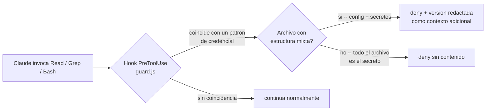

# credential-read-guard

Plugin de Claude Code que bloquea de forma determinista la lectura o
búsqueda de material de credenciales — connection strings, archivos
`.env`, `appsettings*.json`, llaves privadas, `kubeconfig`, `.tfvars`,
entre otros — independientemente del stack del proyecto (.NET, Node,
mobile, infraestructura). El control se aplica a nivel de invocación de
herramienta mediante un hook `PreToolUse`: la llamada se intercepta y se
rechaza antes de ejecutarse, sin depender del comportamiento del modelo.

## Arquitectura



El hook se ejecuta antes de que la herramienta corra, y evalúa lo
siguiente:

| Herramienta | Evaluación |
|---|---|
| `Read` | `file_path` contra una lista de patrones de archivos de credenciales; para `*.yaml`/`*.yml` sin ese nombre, además, el contenido en busca de claves/valores de credencial (ver más abajo) |
| `Grep` | `path`/`glob` contra los mismos patrones, y `pattern` contra palabras clave asociadas a extracción de secretos (`password=`, `connectionstring`, `api_key`, etc.), independientemente del archivo objetivo |
| `Bash` / `PowerShell` | el texto completo del comando, buscando combinaciones de comandos de lectura de contenido (`cat`, `type`, `Get-Content`, `head`, `tail`, `strings`, `base64`, etc.) contra un archivo de credenciales o, si el comando apunta a un único `*.yaml`/`*.yml`, contra su contenido; o `grep`/`findstr`/`Select-String` junto con palabras clave de extracción de secretos |

Un `deny` bloquea unicamente esa llamada puntual a la herramienta -- no
interrumpe la sesion ni descarta el trabajo previo. Cuando el archivo
detectado tiene estructura mixta (configuracion junto con secretos, como
`appsettings*.json`, `.env`, `web.config`/`app.config`, `*.yaml`/`*.yml`),
el hook lee el archivo fuera del contexto del modelo, redacta unicamente
los valores sensibles (por nombre de clave o por contener un patron de
credencial embebido, como `Password=...` dentro de un connection string) y
devuelve esa version redactada junto con el `deny`, de forma que el trabajo
puede continuar sin que el secreto real llegue al modelo.

`*.yaml`/`*.yml` es un caso especial: no hay una convencion de nombre fija
para estos archivos (manifiestos de Kubernetes, `docker-compose`, values de
Helm -- cada proyecto los llama como quiera), asi que en vez de exigir un
nombre como `secrets.yaml`, el hook intenta la redaccion sobre cualquier
`*.yaml`/`*.yml` que se intente leer y compara el resultado contra el
original: si encontro y reemplazo algo (por ejemplo, una variable de
entorno `CONNECTION_STRING` en el patron de lista `- name: ... / value:
...` tipico de un `env:` de Kubernetes), el archivo si tenia credenciales y
se bloquea con la version redactada; si no encontro nada, se permite sin
tocarlo. Esto es distinto de todos los demas patrones de este plugin, que
son unicamente por nombre de archivo.

Ademas, dentro de esos
mismos archivos, cualquier IP (IPv4) con puerto opcional (`IP:puerto` o,
formato SQL Server, `IP,puerto`) se redacta sin importar la clave o el
atributo que la contenga -- revela topologia de infraestructura aunque no
matchee por nombre (`ApiEndpoint`, por ejemplo, no dispara la redaccion por
si solo, pero la IP dentro de su valor si). Esto es distinto de tratar IPs
como palabra clave de busqueda para `Grep` (ver
[Personalización](#personalización)): ahi una IP en texto libre generaria
demasiados falsos positivos, pero aqui solo se redacta dentro de un archivo
que `SENSITIVE_FILE_RE` ya marco como credenciales. Para archivos donde
todo el contenido es en si mismo el secreto (llaves privadas,
certificados, keystores, `kubeconfig`, `.tfstate`) no existe una version
segura que preservar, y el `deny` no incluye contenido.

## Patrones cubiertos

`.env*`, `appsettings*.json`, `web.config`/`app.config`, `*.pfx`, `*.p12`,
`*.pem`, `*.key`, `*.jks`, `*.keystore` (firma de aplicaciones
MAUI/Android), `credentials.json`, `id_rsa`/`id_ed25519` (y variantes
`.pub`), `*.ppk`, `.npmrc`, `.netrc`, `secrets.json`/`secrets.yaml`,
`*.kdbx`, `kubeconfig`, `.aws/credentials`, `*.tfvars`, `*.tfstate`. Además,
por contenido (no por nombre): cualquier `*.yaml`/`*.yml`, sin importar
cómo se llame, si contiene una clave o valor de credencial reconocible
(`CONNECTION_STRING`, `Password=...`, etc. — ver [Arquitectura](#arquitectura)).

## Alcance y limitaciones

Este es un filtro basado en patrones, no un sistema de prevención de fuga
de datos (DLP). Limitaciones conocidas:

- **No inspecciona el contenido de scripts que Claude genere.** Si Claude
  escribe un script en Python o Node que abre un archivo de credenciales y
  lo imprime, y luego lo ejecuta con `Bash`, el hook solo evalúa el
  comando que lo invoca (por ejemplo, `python script.py`), no el
  comportamiento interno del script.
- **Ofuscación deliberada no queda cubierta** — nombres de archivo
  construidos a partir de variables de shell, variaciones de mayúsculas/
  minúsculas fuera del alcance de la expresión regular, o comandos de
  lectura no incluidos en la lista (`sed`, `awk`, `perl -pe`, editores de
  texto invocados vía `Bash`).
- **Los servidores MCP de terceros quedan fuera de alcance.** El hook
  únicamente intercepta las herramientas nativas de Claude Code
  (`Read`/`Grep`/`Bash`/`PowerShell`).
- **La lista de patrones integrada es representativa, no exhaustiva.**
  Proyectos con convenciones propias de nombres de archivo o palabras clave
  deben extenderla mediante `.credentialguardignore` (ver
  [Personalización](#personalización)) en vez de modificar
  `hooks/guard.js`.
- **La redacción solo cubre formatos con estructura reconocida** —
  `appsettings*.json`/`credentials.json`/`secrets.json` (JSON), `.env`,
  `.npmrc`, `.netrc`, `web.config`/`app.config`, y `*.yaml`/`*.yml`. Para
  `kubeconfig`, `.tfvars` y `.tfstate` el `deny` no incluye contenido, ya
  que su estructura no se analiza actualmente (o, en el caso de
  `kubeconfig`, porque se trata como opaco a propósito).
- **La detección en YAML es por línea, no un parser YAML real.** Reconoce
  un mapeo plano (`CLAVE: valor`) y el patrón de lista de Kubernetes/Helm
  (`- name: X` seguido de `value: Y`), pero no escalares de bloque
  multilínea (`|`, `>`) ni un `Secret` de Kubernetes con valores en
  `base64` bajo una clave sin nombre reconocible.

Este plugin constituye un control adicional contra el caso común — Claude
leyendo `appsettings.Development.json` porque lo consideró relevante, o
ejecutando `cat .env` durante una depuración — y no un sustituto de evitar
colocar secretos donde no corresponde, ni de aplicar el principio de mínimo
privilegio en las credenciales y roles usados para cualquier acceso real a
datos.

## Personalización

Los patrones integrados en `hooks/guard.js` cubren convenciones comunes,
pero cada proyecto puede tener las suyas propias. Un archivo
`.credentialguardignore` en la raíz del proyecto — con el mismo modelo que
un `.gitignore` — permite agregar o excluir patrones sin tocar el código
del plugin:

- Una línea = un patrón regex adicional (insensible a mayúsculas) que se
  suma a los patrones de archivo integrados.
- Prefijo `!` excluye un patrón — incluso uno integrado — en vez de
  agregarlo.
- Prefijo `keyword:` agrega una palabra clave de búsqueda de secretos
  (para `Grep`/`grep` por shell) en vez de un patrón de archivo;
  `!keyword:` la excluye.
- Líneas vacías o que empiezan con `#` se ignoran.

Ver [`examples/.credentialguardignore.example`](examples/.credentialguardignore.example)
para un ejemplo completo. Si el archivo no existe, el plugin funciona
igual, solo con los patrones integrados.

## Requisitos

- Claude Code con soporte de plugins y hooks.
- Node.js disponible en `PATH` (usado para ejecutar `hooks/guard.js`).

## Instalación

**Opción A — vía marketplace (recomendada):**

```
/plugin marketplace add DanielWueno/dweno-forge
/plugin install credential-read-guard@dweno-forge
```

[`dweno-forge`](https://github.com/DanielWueno/dweno-forge) es el catálogo de
plugins del mismo autor. `/plugin marketplace add` se ejecuta una sola vez;
`claude plugin update` recoge después cada nueva versión publicada en este
repositorio.

**Opción B — clonado manual, sin marketplace:**

```bash
git clone https://github.com/DanielWueno/credential-read-guard "%USERPROFILE%\.claude\skills\credential-read-guard"
```

Clonar directamente dentro de `~/.claude/skills/<nombre>/` hace que el
plugin cargue automáticamente en cualquier proyecto desde la siguiente
sesión de Claude Code (`credential-read-guard@skills-dir`), sin
configuración por proyecto. Útil si no quieres depender de un marketplace,
o para trabajar sobre una copia local editable.

Después de instalar, reiniciar la sesión de Claude Code (o abrir `/hooks`
una vez) — los hooks se cargan al inicio, no se aplican a una sesión ya en
curso.

## Verificación

No hay razón para confiar en esta descripción sin comprobarlo. Con la
sesión reiniciada y el plugin activo en el proyecto, el comando incluido
lo hace por ti — no hace falta saber dónde quedó instalado el plugin ni ir
a buscar el directorio `examples/` a mano:

```
/credential-read-guard:doctor
```

Corre el mismo `hooks/guard.js` contra los seis fixtures incluidos
(secretos ficticios, valor `estoNoSePinta`) y confirma que cada uno se
comporta como se documenta: los primeros cuatro con `deny` (tres con
estructura mixta, redactados — incluido `demo-crlf.env`, con finales de
línea CRLF, para cubrir el caso común en checkouts de Windows con
`core.autocrlf=true`; el `.pfx`, sin contenido); `normal-config.json`
permitido sin cambios, para confirmar que el plugin no bloquea archivos no
relacionados; y `k8s-deployment.demo.yaml`, con `deny` pese a que su
nombre no sigue ninguna convención reconocida, para confirmar la detección
de YAML por contenido (una `CONNECTION_STRING` embebida en el patrón de
lista `env:` de Kubernetes). `appsettings.demo.json` incluye además un
`ApiEndpoint` con una IP y puerto ficticios, para confirmar que también
quedan redactados dentro de un valor que por nombre de clave no dispara la
redacción por sí solo.

El mismo comando acepta la ruta de un archivo propio del proyecto — útil
para comprobar, por ejemplo, que un campo nuevo como `ApiKey` que acabas
de agregar a tu `appsettings.json` real sí queda cubierto:

```
/credential-read-guard:doctor ruta/a/tu/appsettings.json
```

Esa verificación corre `hooks/guard.js` directo por Node, no un `Read` del
archivo — tu contenido real nunca llega a mí, solo el veredicto
(bloqueado/permitido) y, si aplica, la versión ya redactada.

Si al correr `/credential-read-guard:doctor` sin argumentos algún fixture
sale distinto de lo esperado, o el valor `estoNoSePinta` aparece sin
redactar, el hook no está activo (revisar que la sesión se haya reiniciado
después de instalar).

### Sin pasar por Claude Code en absoluto

Para quien quiera la garantía más fuerte — que ni siquiera una versión ya
redactada pase por una sesión de Claude —, `scripts/doctor.js` es un
script de Node corriente que se puede invocar en tu propia terminal, sin
abrir Claude Code:

```bash
node scripts/doctor.js                       # los 4 fixtures de examples/
node scripts/doctor.js ruta/a/tu/archivo.json # un archivo propio
```

O, para inspeccionar el JSON crudo que el hook le devolvería a Claude:

```bash
echo '{"tool_name":"Read","tool_input":{"file_path":"examples/appsettings.demo.json"}}' | node hooks/guard.js
```

Un objeto JSON con `"permissionDecision":"deny"` indica que la llamada
sería bloqueada; el campo `additionalContext`, cuando está presente,
contiene la versión redactada. Sin salida (exit 0) indica que sería
permitida.

### Atajo `credguard`

`node scripts/doctor.js` funciona, pero exige encontrar a mano la ruta
donde quedó instalado el plugin — un path con el número de versión
adentro (`.../cache/dweno-forge/credential-read-guard/1.2.0/...`), que
cambia en cada `claude plugin update`. El comando

```
/credential-read-guard:atajo
```

instala `credguard`, un lanzador de tres líneas en `~/.local/bin` (donde
ya vive el propio `claude`) que resuelve la instalación del plugin en
cada ejecución, así que sigue funcionando después de cualquier
actualización sin que nadie lo vuelva a tocar. Desde cualquier proyecto,
en cualquier terminal:

```bash
credguard                 # los 4 fixtures de examples/
credguard ruta/archivo    # un archivo propio, sin exponer su contenido
```

También puede instalarse sin pasar por Claude Code:
`bash scripts/instalar-atajo.sh`, parado en este repositorio. Es
idempotente y nunca sobrescribe un `credguard` que no haya puesto este
mismo plugin. Incluye envoltorio `.cmd` para quien trabaje en PowerShell
o cmd.

## Licencia

MIT
